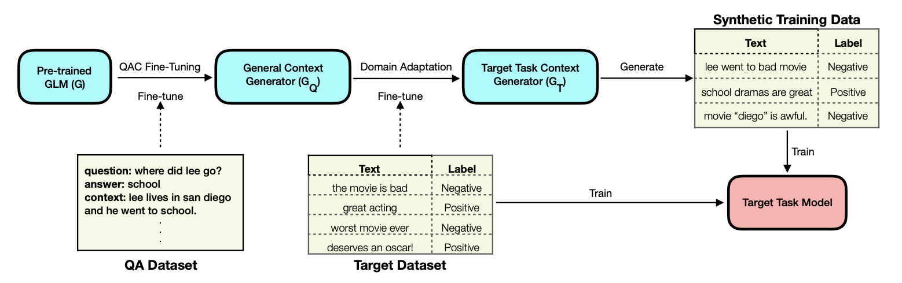

# Leveraging QA Datasets to Improve Generative Data Augmentation

This repository contains code to run ConDA-SocialIQA.
We consider SocialIQA dataset as an example QA dataset and the provided code can be easily modified for other QA datasets.

- [Framework](#framework)
- [Training](#training)
	- [Required Inputs](#required-inputs)
    - [Commands](#commands)
	- [Requirements](#requirements)
- [Citation](#citation)

## Framework


## Training

### Required Inputs
Our framework requires QA datasets and target-task classification datasets.
* All datasets are in `csv` format.
* QA datasets are in `data/qa/` folder. Each sample is in Question-Answer-Context format.
* Target classification datasets are in `data/cls/` folder.
  * Each classification dataset has 3 sub-folders: `train, val, test`. We don't use validation data.
  * `Train` folder have three files corresponding to few-shot supervision obtained from three different random seeds.
  * Note that `train_qac_x.csv` is same as `train/train_x.csv` in QAC format, that is used for domain adaptation step. 


### Commands

The ```scripts/run.sh``` requires three arguments: 
- ```gpu_id``` refers to the id of the gpu. 
- ```tmp_path```, refers to the destination to dump the models.
- ```dataset```, refers to the dataset name. It has to be among ``[sst, agnews, imdb, nyt-coarse, yahoo, yelp]``.

Example command to run:
```shell script
$ sh scripts/run.sh 1 data/tmp agnews
```

Above script performs following thrice for three random seeds (13, 21, 42):
1. QAC fine-tune GPT2-Medium on SocialIQA dataset.
2. Domain Adaptation on target task dataset (AGNews in above example).
3. Generate synthetic training data
4. Train BERT-base classifier.

### Requirements

This project is based on ```python==3.7```. The dependencies are as follows:
```
scikit-learn==0.24.1
torch==1.9.1
argparse==1.1
transformers==4.11.3
datasets==1.12.1
nltk
scipy=1.6.2
numpy==1.20.3
```

## Citation

```
@article{mekala2022intermediate,
  title={Leveraging QA Datasets to Improve Generative Data Augmentation},
  author={Mekala, Dheeraj and Vu, Tu and Schick, Timo and Shang, Jingbo},
  journal={arXiv preprint arXiv:2205.12604},
  year={2022}
}
```
